# DPI

A Nextflow pipeline that detects and reports the "Differences between Pairs of Isolates"

Development for the "Ost er ikke Ost Project"

1. Takes a csv file defining pair of assemblies to compare. 
2. Annotates each individual assembly with [bakta](https://github.com/oschwengers/bakta). 
3. Choses the longest assembly for each pair and defines that the longuest assembly will be used as reference (python script)
4. Runs [nucdiff](https://github.com/uio-cels/NucDiff), (based on MUMmer3) to determine the differences between each pair of isolates
5. Wrangles and transform file format of annotated vcf (python script)
6. Annotates the variants detected for each pair with [vcf-annotator](https://github.com/rpetit3/vcf-annotator)
7. Wrangles and add all the results (from nucdiff, vcf-annotator, and Bakta annotations) in a sqlite database (2 python scripts).  

Workflow: 

# Warning:

Under development. Can still require adjustments.

<!-- outdated 

-->